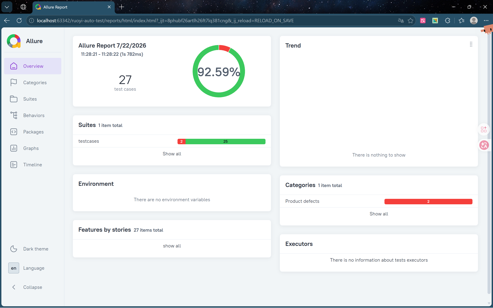
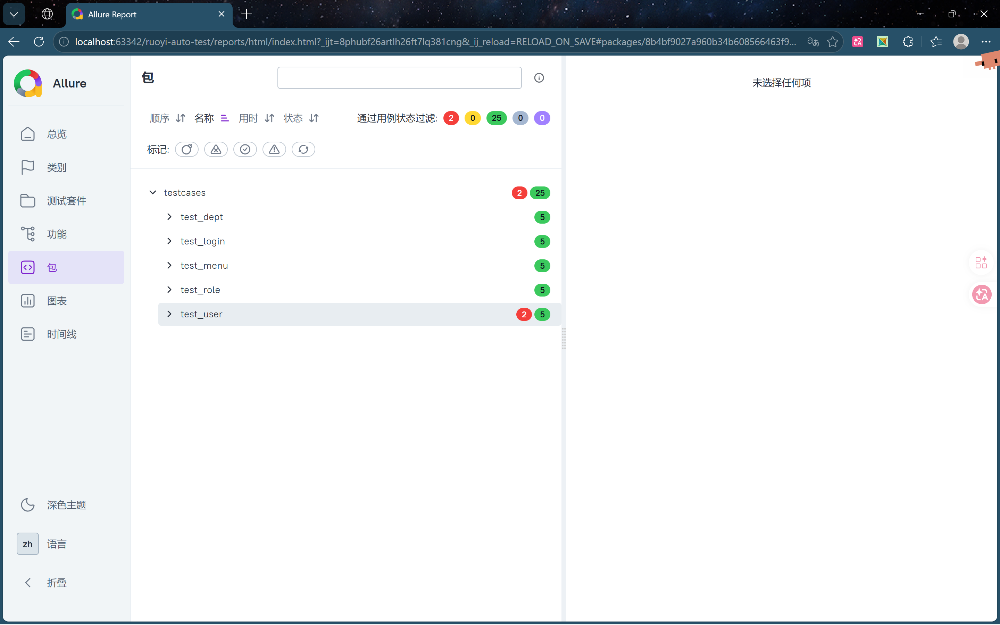
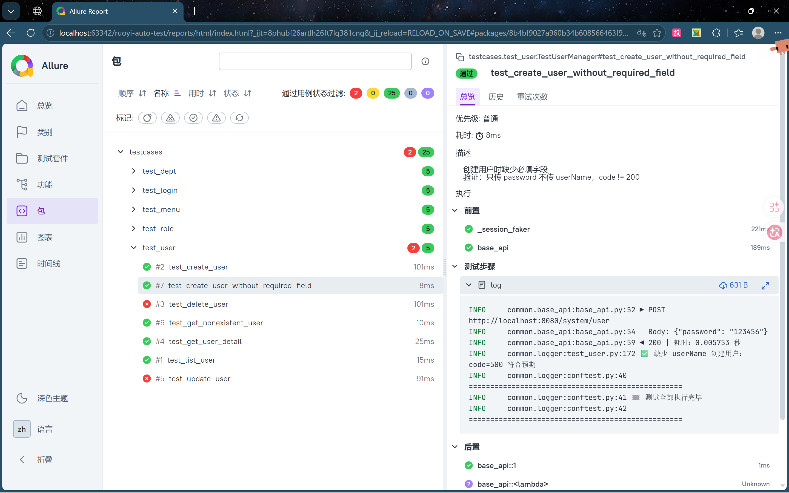
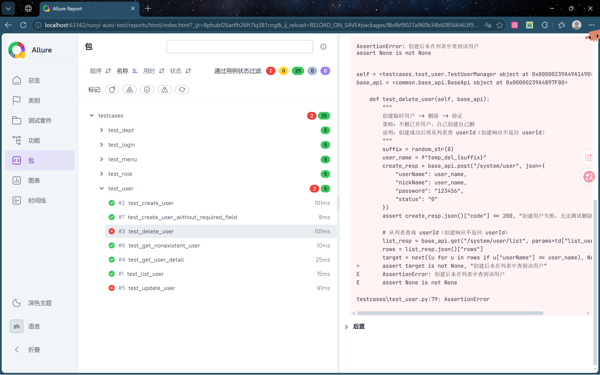
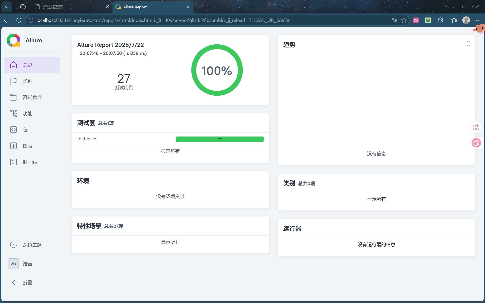

# RuoYi 接口自动化测试

<p align="center">
  <b>基于 RuoYi-Vue v3.9.2（JWT 版）</b><br>
  Python + Requests + Pytest 搭建的接口自动化测试框架
</p>

<p align="center">
  
  
  
  
  
  
</p>
<p align="center">
  覆盖 <b>5 个核心模块</b> · <b>27 条自动化用例</b>
</p>


---

## 目录

- [技术栈](#技术栈)
- [功能特性](#功能特性)
- [项目结构](#项目结构)
- [快速开始](#快速开始)
- [测试覆盖](#测试覆盖)
- [框架架构](#框架架构)
- [踩坑记录](#踩坑记录)
- [运行截图](#运行截图)

---

## 技术栈

| 技术 | 用途 |
|------|------|
| Python 3.12 | 编程语言 |
| Requests 2.x | HTTP 请求库，封装 Session + Token 自动注入 |
| Pytest 9.x | 测试框架，fixture 管理夹具 |
| Allure | 可视化测试报告 |
| YAML | 数据驱动，测试数据与代码分离 |

## 功能特性

- **JWT Token 自动管理** — 登录后自动存储 Token，所有请求自动注入 `Authorization` 头，用例零感知
- **Session 级夹具** — 27 条用例共享一次登录，避免重复登录触发频率限制
- **自动数据清理** — `yield` 机制倒序清理测试数据，不留脏数据
- **数据驱动** — 测试数据与代码分离，修改数据无需改动代码
- **Allure 报告** — 可视化测试报告，直观展示请求 / 响应 / 断言详情

## 项目结构

```
ruoyi-auto-test/
├── config/
│   └── config.yaml           # 环境配置（base_url、账号、超时等）
├── data/
│   ├── login_data.yaml       # 登录模块测试数据
│   ├── user_data.yaml        # 用户管理测试数据
│   ├── role_data.yaml        # 角色管理测试数据
│   ├── menu_data.yaml        # 菜单管理测试数据
│   └── dept_data.yaml        # 部门管理测试数据
├── common/
│   ├── base_api.py           # 核心层：请求封装、Token 管理、异常处理
│   ├── logger.py             # 日志配置：同时输出文件和控制台
│   └── utils.py              # 工具函数：随机字符串、手机号、邮箱
├── testcases/
│   ├── conftest.py           # Pytest fixture：登录夹具 + 数据清理
│   ├── test_login.py         # 登录模块测试（5 条）
│   ├── test_user.py          # 用户管理 CRUD 测试（7 条）
│   ├── test_role.py          # 角色管理 CRUD 测试（5 条）
│   ├── test_menu.py          # 菜单管理 CRUD 测试（5 条）
│   └── test_dept.py          # 部门管理 CRUD 测试（5 条）
├── screenshots/              # 运行截图（README 引用）
├── reports/                  # Allure 测试报告（运行生成，不入库）
├── logs/                     # 日志文件（运行生成，不入库）
├── run.py                    # 一键运行入口脚本
├── pytest.ini                # Pytest 配置
└── requirements.txt          # 依赖清单
```

## 快速开始

### 前置条件

| 条件 | 说明 |
|------|------|
| Python 3.12+ | 推荐使用 pyenv 或 venv 管理环境 |
| Redis 服务 | `redis-cli ping` → `PONG` |
| RuoYi-Vue 后端 | `http://localhost:8080` 可访问 |
| 关闭验证码 | 见下方说明 |

### 1. 克隆仓库

```bash
git clone https://github.com/KingandWorld/ruoyi-auto-test.git
cd ruoyi-auto-test
```

### 2. 安装依赖

```bash
python -m venv venv
# Windows
venv\Scripts\activate
# Linux / macOS
# source venv/bin/activate

pip install -r requirements.txt
```

### 3. 修改配置

编辑 `config/config.yaml`，根据你的 RuoYi 服务地址修改：

```yaml
base:
  base_url: "http://localhost:8080"    # RuoYi 服务地址
  admin:
    username: "admin"                  # 管理员账号
    password: "admin123"               # 管理员密码
```

> **注意**：RuoYi-Vue 默认开启验证码，测试前需关闭：
> ```sql
> UPDATE sys_config SET config_value='false' WHERE config_key='sys.account.captchaEnabled';
> ```

### 4. 运行测试

一键运行：

```bash
python run.py
```

或直接使用 pytest：

```bash
pytest testcases/ -v
```

### 5. 查看 Allure 报告

```bash
allure generate ./reports -o ./reports/html --clean
allure open ./reports/html
```

---

## 测试覆盖

| 模块 | 接口数 | 用例数 | 覆盖类型 |
|------|:------:|:------:|----------|
| 登录 | 1 | 5 | 正向 + 4 异常场景 |
| 用户管理 | 5 | 7 | CRUD + 查询详情 + 异常场景 |
| 角色管理 | 5 | 5 | CRUD + 详情查询 |
| 菜单管理 | 5 | 5 | CRUD + 详情查询 |
| 部门管理 | 5 | 5 | CRUD + 详情查询 |
| **合计** | **21** | **27** | |

## 框架架构

采用**四层架构**设计，层次清晰、职责分明：

```
┌──────────────────────────────────────────────┐
│               用例层 (testcases/)              │
│   test_login / test_user / test_role / …     │
│   YAML 数据驱动 + 断言逻辑                    │
├──────────────────────────────────────────────┤
│              核心层 (common/)                  │
│   BaseApi — 请求封装、Token 自动注入          │
│   Logger — 统一日志输出                       │
│   Utils — 随机数据生成                       │
├──────────────────────────────────────────────┤
│              数据层 (data/)                    │
│   5 个 YAML 文件，参数与预期结果分离          │
├──────────────────────────────────────────────┤
│              配置层 (config/)                  │
│   config.yaml — 环境、账号、超时配置          │
└──────────────────────────────────────────────┘
```

### 关键设计

- **JWT Token 自动管理**：`BaseApi` 登录后自动存储 token，后续所有请求自动注入 `Authorization` 头，测试用例无需关心鉴权细节
- **Session 级别夹具**：`conftest.py` 中 `base_api` fixture 设为 `session` scope，27 条用例共享一次登录，避免重复登录触发频率限制
- **自动数据清理**：`cleanup_ids` fixture 使用 `yield` 机制，用例执行后自动倒序清理创建的测试数据
- **数据驱动**：测试数据统一存放在 `data/` 下的 YAML 文件中，修改数据无需改动代码

---

## 踩坑记录

| 问题 | 原因 | 解决方案 |
|------|------|----------|
| 登录报"验证码错误" | 验证码未关闭 | `UPDATE sys_config SET config_value='false' WHERE config_key='sys.account.captchaEnabled'` |
| 后端启动报 Redis 连接失败 | Redis 服务未运行 | 启动 `redis-server`（Windows 默认路径 `C:\tool\redis\redis-server.exe`） |
| `Session.timeout` 不生效 | `requests.Session` 没有 `timeout` 属性 | 在 `request()` 方法中传参 `kwargs.setdefault("timeout", self.timeout)` |
| 新创建用户在列表中查不到（分页溢出） | 系统默认 pageSize=10，当已有≥10 条用户时，新用户会落在第 2 页，原代码只查第 1 页 | 列表查询时追加 `userName` 过滤参数，按用户名精准搜索，绕过翻页限制（详见文末 [踩坑详解](#踩坑详解分页导致的用户查询失败)） |
| RuoYi 默认端口 80 被占用 | 端口冲突 | 启动时指定 `--server.port=8080` |
| Shiro 版 vs Vue 版登录方式不同 | RuoYi 有 Shiro 和 JWT 两个版本 | Shiro 用 `data=`（form-encoded），Vue 用 `json=`（JSON），需确认版本 |

---

## 运行截图

### Allure 报告概览

<p align="center">
  
</p>


### 测试用例列表

<p align="center">
  
</p>


### 通过用例详情

<p align="center">
  
</p>


### 失败用例详情

<p align="center">
  
</p>

---

### 踩坑详解：分页导致的用户查询失败

#### 问题现象

运行用户管理测试时，`test_create_user` 和 `test_update_user` 两个用例偶发失败：

```
❌ 创建后未在列表中查到该用户
```

但数据库确认用户已创建成功（`sys_user` 表中有数据），且通过 UI 界面能看到该用户存在于第 2 页。

#### 原因分析

RuoYi-Vue 的用户列表接口 `/system/user/list` 默认分页大小为 10（`pageSize=10`）。当数据库中用户数量 ≥ 10 时（首次执行测试后累计），新创建的用户会被分配到第 2 页（`pageNum=2`）。

原代码只按照默认参数查询第 1 页：

```python
# ❌ 错误代码 —— 只查第 1 页
list_resp = base_api.get("/system/user/list", params={"pageNum": 1, "pageSize": 10})
rows = list_resp.json()["rows"]
target = next((u for u in rows if u["userName"] == user_name), None)
# target 为 None → 断言失败
```

#### 解决方案

在查询参数中追加 `userName` 字段，RuoYi 后端会根据用户名模糊搜索，绕过翻页限制：

```python
# ✅ 修复代码 —— 按用户名精确过滤
list_params = {"pageNum": 1, "pageSize": 10, "userName": user_name}
list_resp = base_api.get("/system/user/list", params=list_params)
rows = list_resp.json()["rows"]
target = next((u for u in rows if u["userName"] == user_name), None)
# target 不为 None → 成功
```

#### 影响范围

| 用例 | 所属文件 | 修复行 |
|------|----------|--------|
| `test_create_user` — 创建后从列表确认用户已存在 | `testcases/test_user.py` | `{**td["list_user"]["params"], "userName": user_name}` |
| `test_update_user` — 创建后从列表获取完整 user 对象 | `testcases/test_user.py` | `{**td["list_user"]["params"], "userName": body["userName"]}` |

| 修复前 | 修复后 |
|:------:|:------:|
| 传入固定 `pageNum=1, pageSize=10` 查列表 | 追加 `userName` 参数，按用户名过滤 |
| 新用户落在第 2 页，列表中查不到 | 后端返回匹配用户名的结果，不受翻页影响 |
| 偶发失败（取决于系统已有用户数） | 稳定通过 |

修复后全部 27 条用例通过：

<p align="center">
  
</p>

---

*本项目为接口自动化测试学习项目，基于 RuoYi-Vue v3.9.2，仅限学习和测试用途。*
